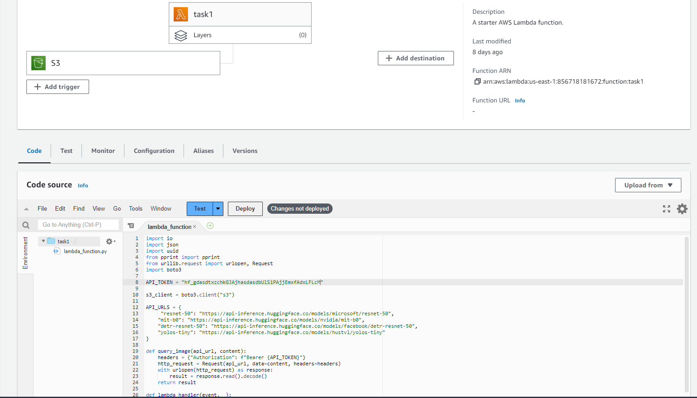

# AWS lambda handler with hugging face

This lambda handler is fired when the user uploads an image to the s3 bucket, then retrieves the data from the hugger face and saves it as a json file.

## Installation

In `handler.py` change the hugging face api token .

```python
API_TOKEN = "hf_gdasdtxzchkGJAjhasdasdbUlSiPAjjEmxfAdxLFLcM"
```

## Usage

- Optional: update/change hugging face links in `handler.py`
- Create lambda function, [link](https://us-east-1.console.aws.amazon.com/lambda/home?region=us-east-1#/create/function)
- Add trigger s3 bucket.
- Insert handler code, or upload handler.py as zip file in coude source.
- Upload file in S3 bucket.
- Check result(json files) in S3 bucket.

### Usage - Lambda handler page



## Result

I have done some test, you can check json files in result folder.
